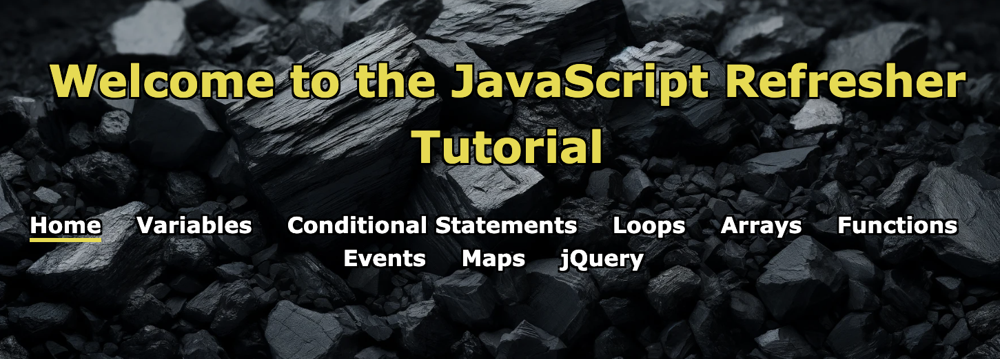

# JavaScript-Refresher-Tutorial

[Check out the live site here!](https://m311han.github.io/JavaScript-Refresher-Tutorial/)



Explore a wide range of topics on JavaScript, jQuery, and more. Each module comes with a fun quiz to test your knowledge and reinforce learning. Dive into the lessons and challenge yourself with the quizzes to see how much you've learned!

## Description

The JavaScript Refresher Tutorial is designed to help developers of all skill levels improve their understanding and proficiency in JavaScript. Covering a broad range of topics from basic syntax to complex functions, this interactive tutorial provides hands-on experience with real code examples and exercises. It's an ideal resource for those looking to refresh their knowledge or learn new aspects of JavaScript, including ES6 features, jQuery, and more. The site is fully mobile-responsive, ensuring a seamless learning experience on any device.

## Table of Contents

- [Installation](#installation)
- [Features](#Features)
- [Technologies](#Technologies)
- [Usage](#usage)
- [Credits](#credits)

## Installation

```bash
# Open a terminal

# Clone the repository by typing:
git clone https://github.com/M311HAN/JavaScript-Refresher-Tutorial.git

# Navigate into the cloned directory with:
cd JavaScript-Refresher-Tutorial

# Open with live server (you need to have Live Server extension installed on your code editor) If you are not using VS Code or don't have the "Live Server" extension, you can simply open the index.html file with any web browser to view the website.
```
## Features

- Interactive coding exercises
- End-of-section quizzes to test your knowledge
- Responsive design for learning on any device

## Technologies

- HTML5
- CSS3
- JavaScript ES6
- jQuery

## Usage
Navigate through the tutorial by using the navigation bar to access different JavaScript topics such as Variables, Loops, Functions, Events, Maps, and jQuery. Each section includes explanations, code snippets, and interactive exercises to enhance learning. Utilize the provided quizzes to test your knowledge after studying each topic.

## Credits

This project was created by Melihhan (https://github.com/M311HAN). [Visit the repository](https://github.com/M311HAN?tab=repositories) for more projects and further collaboration.
